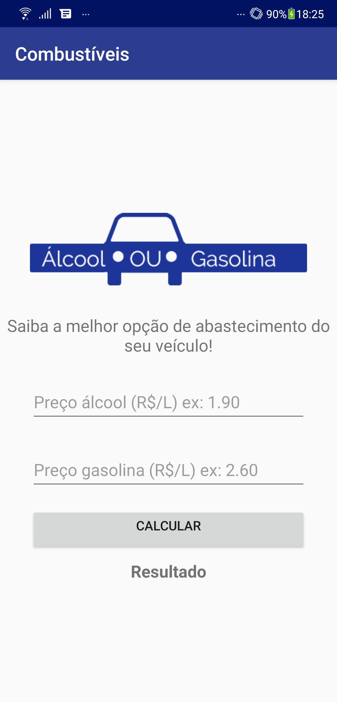
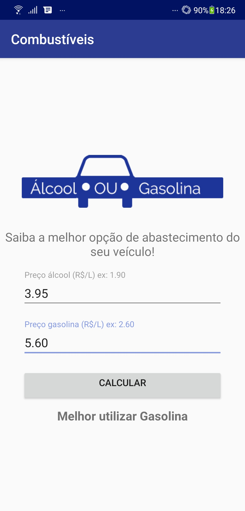

    <h1> Álcool ou Gasolina </h1>

 

<h2> 💡 Descrição </h2>
Aplicativo que calcula qual opção de combustível é mais vantajosa para abastecer o veículo 
a combustão (álcool ou gasolina).

 

| | | |
|:-------------------------:|:-------------------------:|:-------------------------:|
| | ||
 

